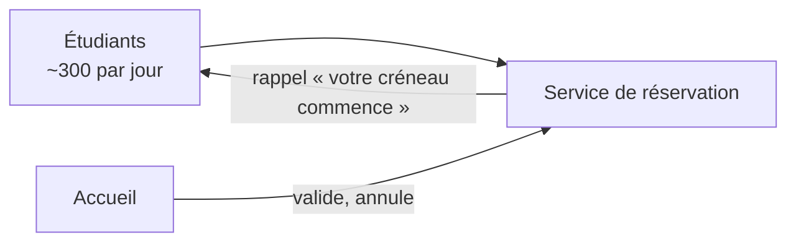

# Réservation des salles de la médiathèque : ce que l'équipe doit savoir

**Objectif :** fixer les contraintes réelles du service de réservation, pour décider ce que l'équipe peut construire avant la rentrée.

**De :** l'équipe produit, **À :** la responsable de la médiathèque, **Usage des réponses :** recopiées sur [exemple/reservations#1](https://github.com/exemple/reservations/issues/1), puis dans le dossier de conception.

## Contexte

Environ 30 salles de travail sont réservées chaque jour par les étudiants, aujourd'hui sur un cahier à l'accueil. Le nouveau service remplace ce cahier.

- **Accueil** : l'agent·e valide les réservations et gère les imprévus.
- **Étudiants** : ils réservent un créneau d'une heure, au plus deux par jour.

**Le calendrier :**
1. **2 septembre** — ouverture aux étudiants de première année.
2. **16 septembre** — ouverture à tous ; le cahier est retiré.
3. **Décembre** — période d'examens, où la demande double.

| Salle | Places | Équipement |
| --- | --- | --- |
| Rotonde | 8 | écran, tableau blanc |
| Cèdre | 4 | tableau blanc |

## Comment répondre

Réponds directement sous chaque question, dans l'ordre que tu veux. Chaque section s'ouvre sur **En bref** ; sous certaines questions, **Mon avis** dit ce que je ferais. « Je ne sais pas » est une bonne réponse.

## Réservations

**En bref :** les règles actuelles tiennent dans la tête de l'accueil. Les questions ci-dessous les rendent explicites.

### Combien de créneaux un étudiant peut-il réserver d'avance ?

_Pourquoi c'est important : une limite trop haute laisse quelques-uns bloquer les salles pour la semaine._

**Mon avis :** deux créneaux par jour, sur sept jours glissants.

>

### Que se passe-t-il quand un étudiant ne se présente pas ?

_Pourquoi c'est important : c'est la plainte la plus fréquente à l'accueil._

_Deux précisions dont j'ai besoin : au bout de combien de minutes la salle est-elle libérée, et l'étudiant est-il pénalisé ?_

>

### Le service peut-il envoyer un rappel par `mail@exemple.fr` ~15 minutes avant le créneau ?

>

## Données

**En bref :** le service stocke le nom de l'étudiant et ses créneaux, rien d'autre.

### Combien de temps l'historique des réservations doit-il être conservé ?

>

## Autre chose ?

Y a-t-il quelque chose qu'on n'a pas demandé et qu'on devrait savoir ?

>
